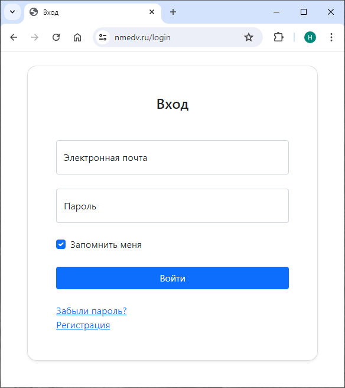
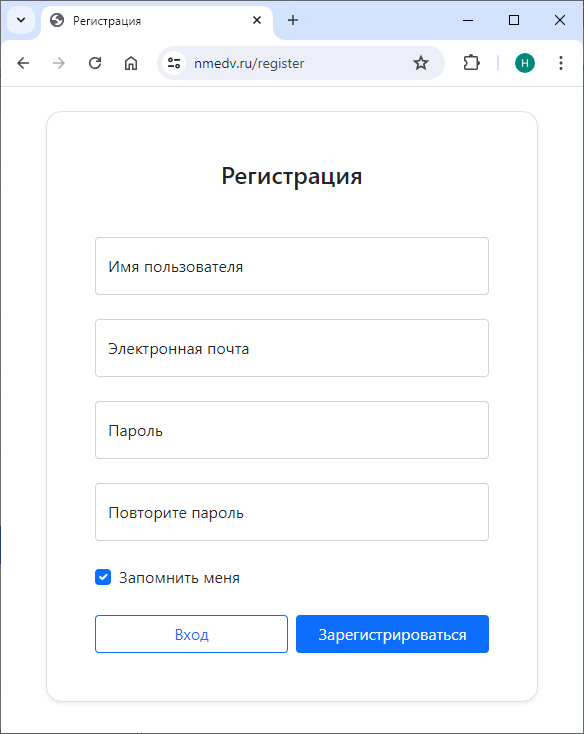
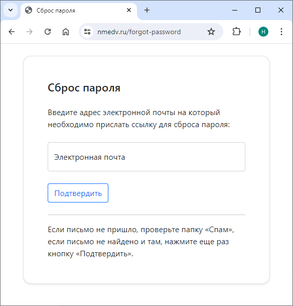
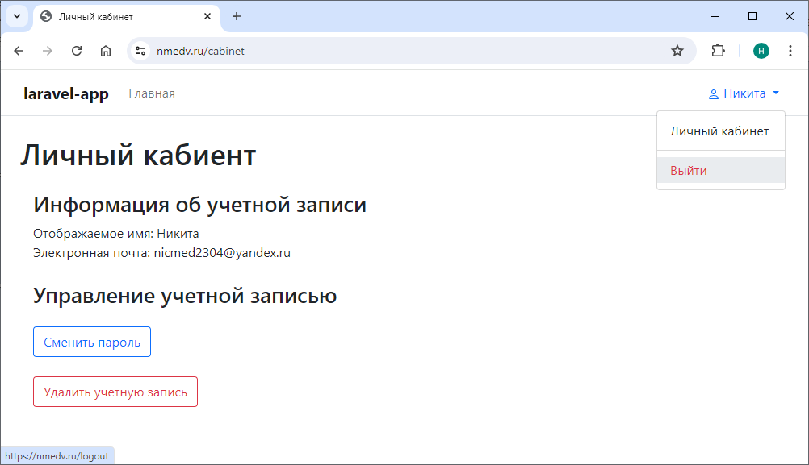

# laravel-app

This is a small test application implemented using the Laravel framework. The application implements a working user accounting system: registration system, login system, password reset system with confirmation via email and so on. The frontend of the site was created using the Bootstrap library. Docker is used to deploy the application.

## Screenshots:






## How to run app

Create .env file by copying the template:
```bash
cp .env.example .env
```

Launch the container with production mode:
```bash
docker compose -f ./docker-compose.yml up -d
```

or with developing mode:
```bash
docker compose -f ./docker-compose-dev.yml up -d
```

Install composer dependencies (if on dev set):
```bash
docker exec app composer install
```

If the error "exceeded the timeout of 300 seconds" appears, then try:
```bash
docker exec app composer install -o -vvv
```

Create database:
```bash
docker exec app touch database/database.sqlite
```

Make migrations:
```bash
docker exec app php artisan migrate
```


Then generate the application key:
```bash
docker exec app php artisan key:generate
```


Good luck. Enjoy!